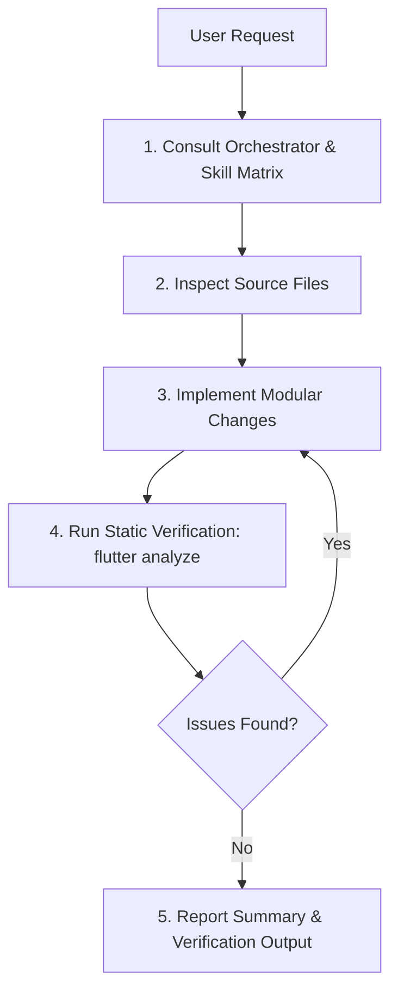

# Hatly Master AI Orchestrator Guidelines

This document serves as the **Master Orchestrator Guide** for Antigravity AI agents working on the **Hatly** codebase (Flutter, Riverpod, Firebase, Glassmorphic UI).

---

## 🎯 1. Master Skill Dispatcher Matrix

Whenever the user requests a task, **refer to this matrix** to select and execute the optimal Antigravity Skill before or during implementation.

| Task Category | Trigger / Condition | Skill to Consult & Execute |
| :--- | :--- | :--- |
| **New Feature & Spec Design** | User wants to design or scaffold a new complex feature | [`brainstorming`](file:///C:/Users/ahmed/.gemini/config/skills/brainstorming/SKILL.md) |
| **Architecture & Layering** | Structuring features into UI, Controller, Domain, Data | [`flutter-apply-architecture-best-practices`](file:///C:/Users/ahmed/.gemini/config/plugins/flutter/skills/flutter-apply-architecture-best-practices/SKILL.md) |
| **UI Layouts & Responsiveness**| Building adaptive screens, fixing overflow/unbounded errors | [`flutter-build-responsive-layout`](file:///C:/Users/ahmed/.gemini/config/plugins/flutter/skills/flutter-build-responsive-layout/SKILL.md) & [`flutter-fix-layout-issues`](file:///C:/Users/ahmed/.gemini/config/plugins/flutter/skills/flutter-fix-layout-issues/SKILL.md) |
| **Widget Previews & Components**| Adding interactive UI widget previews | [`flutter-add-widget-preview`](file:///C:/Users/ahmed/.gemini/config/plugins/flutter/skills/flutter-add-widget-preview/SKILL.md) |
| **Data Models & Serialization** | Writing or updating `fromMap`, `toMap`, `copyWith` | [`flutter-implement-json-serialization`](file:///C:/Users/ahmed/.gemini/config/plugins/flutter/skills/flutter-implement-json-serialization/SKILL.md) |
| **Modern Dart Idioms** | Constructor refactoring, pattern matching, switch expressions | [`dart-use-primary-constructors`](file:///C:/Users/ahmed/.gemini/config/plugins/flutter/skills/dart-use-primary-constructors/SKILL.md) & [`dart-use-pattern-matching`](file:///C:/Users/ahmed/.gemini/config/plugins/flutter/skills/dart-use-pattern-matching/SKILL.md) |
| **Routing & Navigation** | Adding GoRouter paths, query parameters, shell routes | [`flutter-setup-declarative-routing`](file:///C:/Users/ahmed/.gemini/config/plugins/flutter/skills/flutter-setup-declarative-routing/SKILL.md) |
| **Push & Real-time Notifications**| FCM HTTP v1 direct dispatch, local notification popups | [`notification-system-maker`](file:///C:/Users/ahmed/.gemini/config/skills/notification-system-maker/SKILL.md) |
| **HTTP / REST API Integrations**| Direct REST API calls or external webhooks | [`flutter-use-http-package`](file:///C:/Users/ahmed/.gemini/config/plugins/flutter/skills/flutter-use-http-package/SKILL.md) |
| **Runtime Errors & Debugging** | Fixing runtime crashes, exceptions, or package conflicts | [`dart-fix-runtime-errors`](file:///C:/Users/ahmed/.gemini/config/plugins/flutter/skills/dart-fix-runtime-errors/SKILL.md) & [`dart-resolve-package-conflicts`](file:///C:/Users/ahmed/.gemini/config/plugins/flutter/skills/dart-resolve-package-conflicts/SKILL.md) |
| **Unit & Widget Testing** | Writing tests for models, controllers, or UI widgets | [`dart-add-unit-test`](file:///C:/Users/ahmed/.gemini/config/plugins/flutter/skills/dart-add-unit-test/SKILL.md), [`flutter-add-widget-test`](file:///C:/Users/ahmed/.gemini/config/plugins/flutter/skills/flutter-add-widget-test/SKILL.md), & [`dart-generate-test-mocks`](file:///C:/Users/ahmed/.gemini/config/plugins/flutter/skills/dart-generate-test-mocks/SKILL.md) |
| **Code Review & Audits** | Deep security, performance, and cleanliness reviews | [`ultimate-code-reviewer`](file:///C:/Users/ahmed/.gemini/config/skills/ultimate-code-reviewer/SKILL.md) |
| **Code Base Knowledge Graph** | Analyzing relationships, dependencies, and architecture | [`graphify`](file:///C:/Users/ahmed/.gemini/config/skills/graphify/SKILL.md) |
| **Codebase Snapshot & Blueprint**| Generating or updating high-density token-efficient snapshot | [`snapshot-maker`](file:///C:/Users/ahmed/.gemini/config/skills/snapshot-maker/SKILL.md) |
| **Static Verification** | Running linter checks & applying mechanical auto-fixes | [`dart-run-static-analysis`](file:///C:/Users/ahmed/.gemini/config/plugins/flutter/skills/dart-run-static-analysis/SKILL.md) |

---

## 🛠️ 2. Execution Workflow Protocol

Whenever executing edits on **Hatly**, strictly adhere to this 5-stage protocol:

### Stage 1: Skill Selection
- Identify the relevant domain skill from the **Skill Dispatcher Matrix**.
- Read the skill file using `view_file` if the task involves complex steps.

### Stage 2: Codebase Inspection
- Never guess code logic or class properties.
- Use `view_file` to read existing files and `grep_search` to verify call sites across `lib/features/` and `lib/core/`.

### Stage 3: Modular Implementation
- Keep components decoupled:
  - `data/`: Repositories handling Firestore & Auth.
  - `domain/`: Pure Dart Data Models (`UserModel`, `HouseholdModel`, `ShoppingListModel`, `ShoppingItemModel`, `CategoryModel`).
  - `presentation/`: Riverpod `ConsumerStatefulWidget` / `ConsumerWidget` + `StateNotifier` controllers.
- Reuse core widgets:
  - Header: [`HatlyHeaderBar`](file:///c:/Users/ahmed/Desktop/flutter/hatly/lib/core/widgets/hatly_header_bar.dart)
  - Cards: [`GlassCard`](file:///c:/Users/ahmed/Desktop/flutter/hatly/lib/core/widgets/glass_card.dart)
  - Dialogs: [`showGlassConfirmationDialog`](file:///c:/Users/ahmed/Desktop/flutter/hatly/lib/core/widgets/glass_dialog.dart)
  - Badges: [`CategoryBadge`](file:///c:/Users/ahmed/Desktop/flutter/hatly/lib/core/widgets/category_badge.dart)

### Stage 4: Static Verification
- Run `flutter analyze` via `run_command` after any code edits.
- Ensure **0 errors, 0 warnings, 0 unused imports**.

### Stage 5: Verification & Walkthrough
- Provide a concise summary of edits made and test results.

### Stage 6: Maintain Token-Efficient Project Snapshot
- After completing and verifying code edits, update [`snapshot.md`](file:///c:/Users/ahmed/Desktop/flutter/hatly/snapshot.md) at the project root to keep project state, providers, and component changes synchronized.
- Prior to starting complex edits, consult `snapshot.md` first to minimize token usage.

---

## 🎨 3. Hatly Architecture & Design System Standard

- **Theme & Colors:**
  - Background: Radial dark gradient (`#11253E` → `#081425` → `#040E1F`).
  - Accent Color: Primary Emerald (`#10B981`, `AppTheme.primaryEmerald`).
  - Font: `GoogleFonts.sora`.
- **Firebase Infrastructure Constraints:**
  - **Spark Free Tier Only**: No Firebase Cloud Functions allowed. All FCM push dispatches must use `NotificationService` direct HTTP v1 with Service Account OAuth 2.0 (`.env`).
- **State Management:**
  - `flutter_riverpod` state streams and state notifiers. Always clean up listeners and dispose text controllers cleanly.
